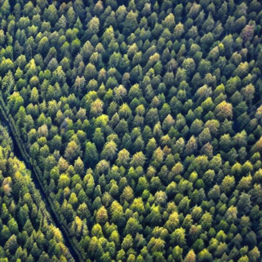
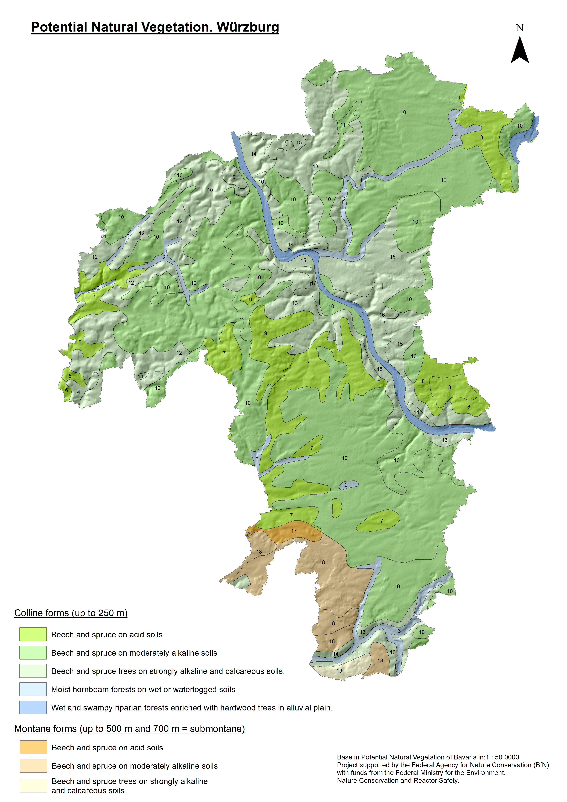
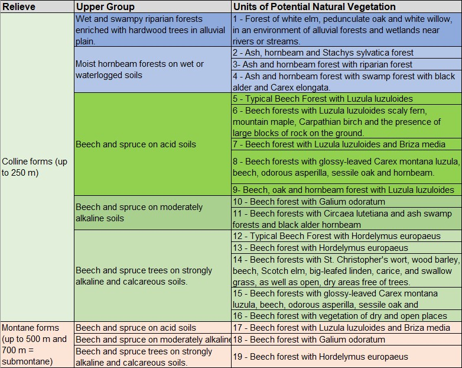
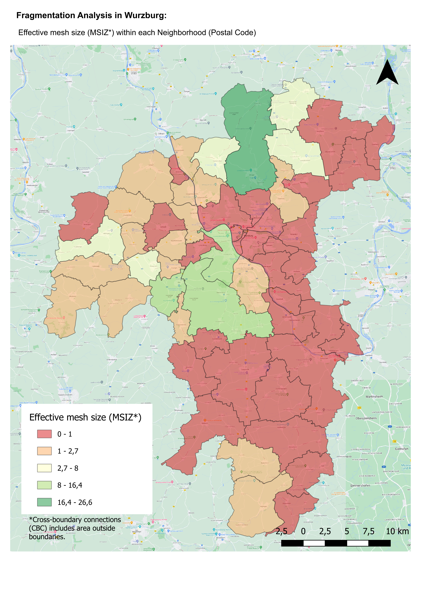
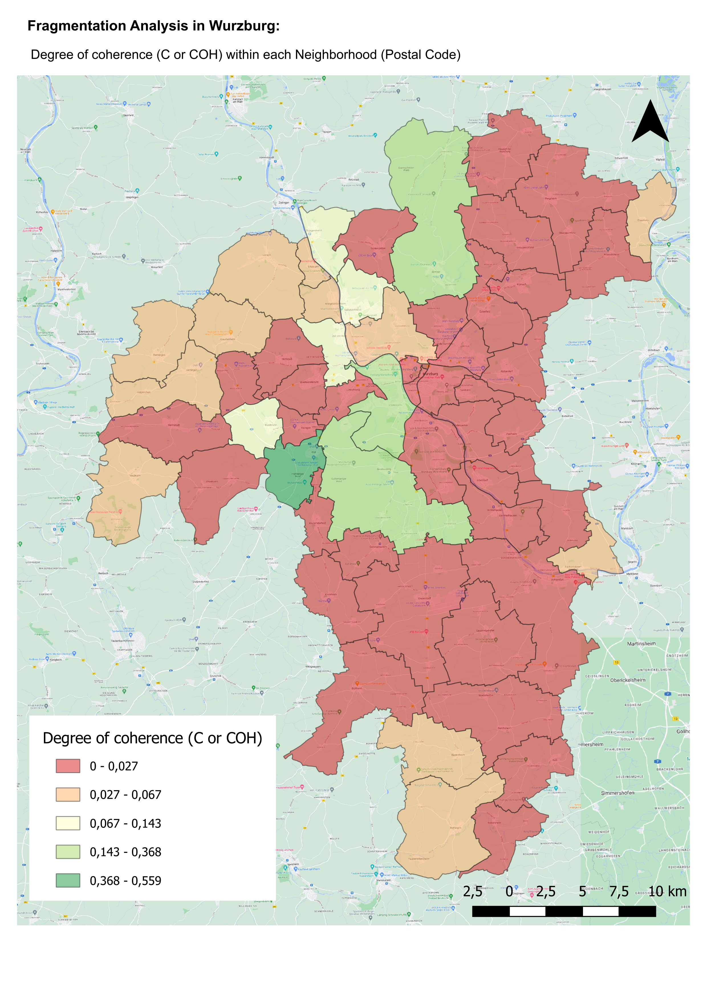
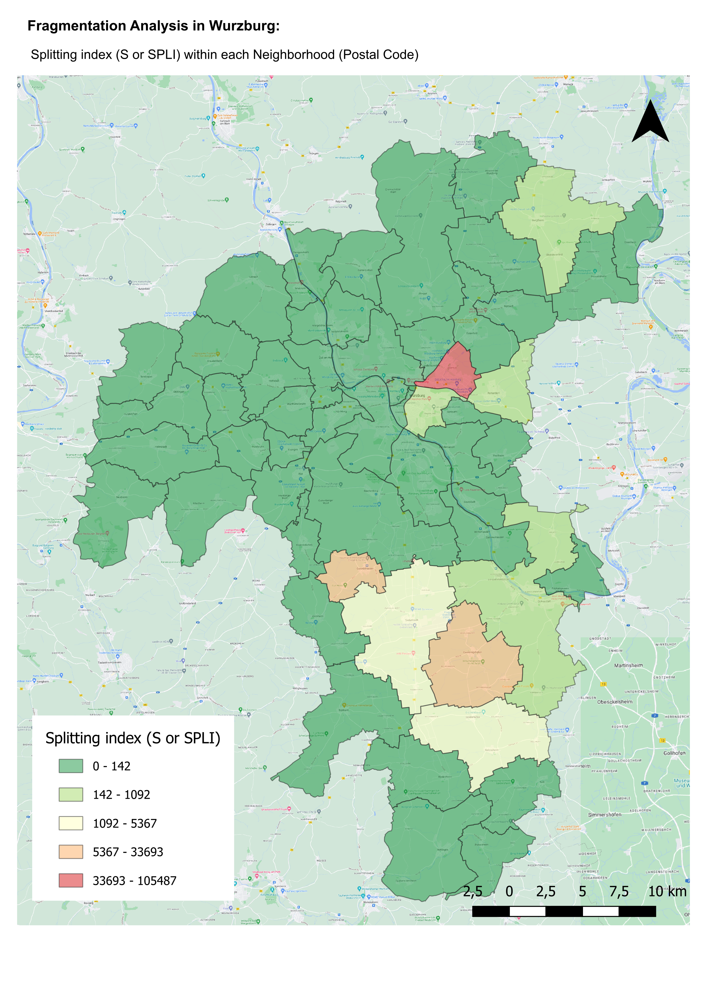
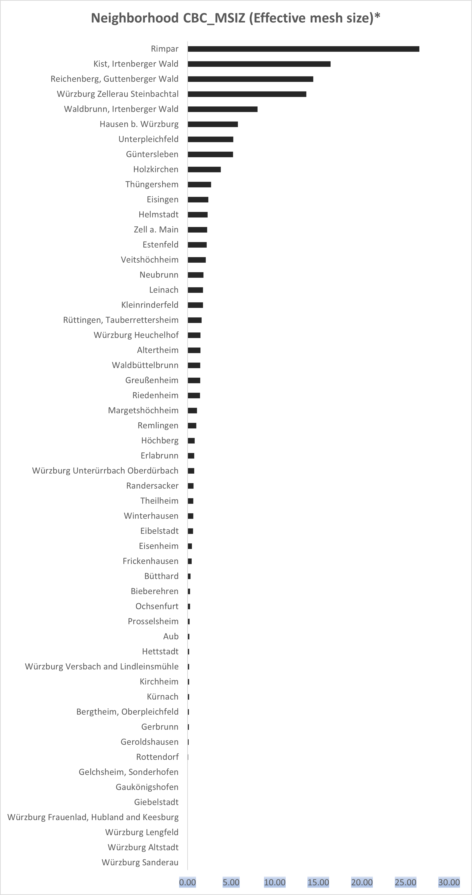
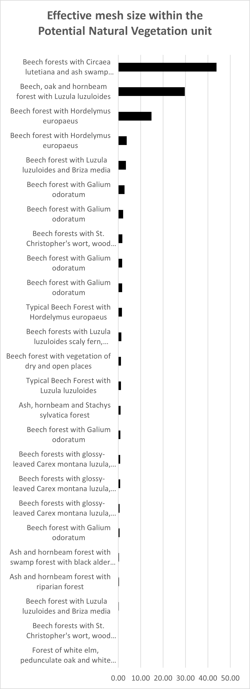

# Forest fragmentation in the Würzburg district, Bayern, Germany

## Introduction
In recent years, the fragmentation of forests has become a significant concern for ecosystems and biodiversity. This analysis aims to explore the extent of forest fragmentation in the district of Würzburg, Bayern, Germany. The study is conducted as part of the final project for the **Digital Image Analysis and GIS Class**, taught by Dr. Martin Wegmann, within the framework of the _Master's Degree in Earth Observation and Geoinformation Science (EAGLE) program_ at the University of Würzburg.

Forest fragmentation not only threatens the ecological integrity of forested landscapes but also has severe implications on the overall health of ecosystems, as it impacts species distribution, connectivity, and resilience to disturbances. In the context of climate change and increasing anthropogenic pressures, understanding the patterns and drivers of fragmentation is essential for developing effective conservation strategies and forest management plans.

Leveraging cutting-edge tools in digital image analysis and geographic information systems, this study will assess the forest fragmentation patterns in the Würzburg district. The results will provide valuable insights into the state of the region's forests, identify potential threats, and contribute to the development of sustainable forest management practices. This analysis will, therefore, play a crucial role in preserving the ecological integrity of the Würzburg district, ultimately benefiting its inhabitants and the environment alike.

## Study Area
The Würzburg district, located in Bavaria, Germany, features diverse landscapes, including the Main River valley, hills, and plateaus. Its temperate climate supports a mix of deciduous and coniferous forests, which provide vital ecosystem services. The region's economy relies on agriculture, viticulture, and forestry, with Franconian wine being a renowned local product. Increasing urban expansion and agricultural intensification threaten the district's forests and landscapes, making the study of their characteristics and fragmentation vital for sustainable land-use practices and conservation efforts.

## Materials and methods
This analysis utilized QGIS for mapping and fragmentation analysis, employing the FragScape v2.03 plugin (Chailloux et al., 2019). Input data included the Corine Land Cover (CLC) 2018(https://land.copernicus.eu/), OpenStreetMap's natural regions and roads layer (https://www.openstreetmap.org), and Sentinel-2 10m Land Use/Land Cover provided by Esri, Impact Observatory, and Microsoft (https://livingatlas.arcgis.com/landcoverexplorer).

The study examined fragmentation in two landscape contexts: natural and cultural. For the natural context, a map of potential vegetation units at a 1:500,000 scale was used, obtained from a project funded by the Federal Agency for Nature Conservation (BfN) and the Federal Ministry for the Environment, Nature Conservation and Reactor Safety (https://www.lfu.bayern.de/index.htm). The data underwent preprocessing and generalization for improved interpretation of the results. The cultural context was assessed using the delimitation of postal zones within the region (https://ec.europa.eu/eurostat/web/gisco/geodata/reference-data), reflecting the evolution of each territory's socio-demographic landscape.

Fragmentation indices were calculated, with one index selected for each fragmentation dimension in the final analysis and maps: landscape division, splitting index, and effective mesh size. The degree of coherence (C or COH), an auxiliary measure, represents the probability of two randomly chosen points in a region being connected. The splitting index (S or SP LI) quantifies the number of equally-sized patches resulting in the same degree of fragmentation as the initial configuration. The effective mesh size (m or MSIZ) indicates the size of areas with the same landscape division as the initial configuration when dividing the region into equal-sized areas.

For further information on these indices, refer to Jaeger (2000) or consult the tool's user manual (https://github.com/MathieuChailloux/FragScape)

### Results

#### Resulting maps

#### Graphical Summaries

### Conclusions

        1) Urban expansion in the district has unsurprisingly impacted the natural forest types within the region.

        2) In the Rimpar, Guttenberger Wald, and Irtenberger postal zones, forest fragments exhibit the least isolation, with Rimpar hosting one of the largest forest patches in the area.

        3) Despite efforts in urban tree management, the town of Würzburg experiences significant forest fragmentation across most of its zones.

        4) From a natural perspective, it is evident that forests along riverbanks and wetlands have been substantially affected. This poses a risk to the hydrological regulation within the landscape and disrupts the exchange of material flows within these crucial connectivity elements.

        5) Beech and pine forests, however, continue to maintain satisfactory connectivity between their respective patches.

### Bibliography
Chailloux, M. & Chéry, J.P. & Amsallem, J. (2019) FragScape : a QGIS plugin to quantify landscape fragmentation. https://github.com/MathieuChailloux/FragScape

Jochen Jaeger. “Landscape division, splitting index, and effective mesh size: New measures of landscape fragmentation”. In: Landscape Ecology 15 (Feb. 2000), pp. 115–130. DOI: 10.1023/A:
1008129329289.

Brigitte Moser et al. “Modification of the effective mesh size for measuring landscape fragmentation to solve the boundary problem”. In: Landscape Ecology 22 (Mar. 2007), pp. 447–459. DOI: 10.1007/s10980-006-9023-0.
